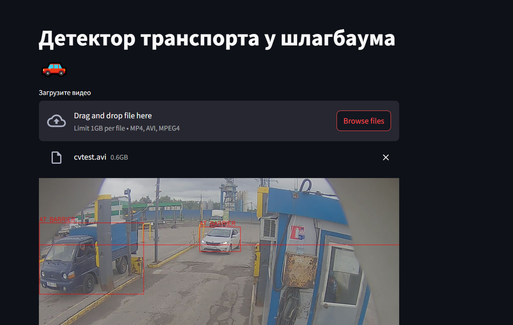

# Система детекции транспорта у шлагбаума 🚗🚦

 <!-- Можно добавить gif-пример работы -->

Система для обнаружения транспорта перед шлагбаумом в реальном времени с использованием YOLOv8 и Streamlit. Определяет момент, когда транспортное средство пересекает виртуальную линию шлагбаума.

## Возможности ✨

- Детекция транспорта в реальном времени (легковые, грузовики, автобусы, мотоциклы)
- Визуализация виртуальной линии шлагбаума
- Цветные bounding boxes:
  - 🟢 Зеленый - транспорт приближается
  - 🔴 Красный - транспорт у шлагбаума (пересек линию)
- Простой веб-интерфейс на Streamlit

## Технологии 🛠️

- Python 3.8+
- OpenCV (обработка видео)
- YOLOv8 (детекция объектов)
- Streamlit (веб-интерфейс)
- NumPy

## Установка ⚙️

1. Клонируйте репозиторий:
```bash
git clone https://github.com/ваш_username/barrier-vehicle-detection.git
cd barrier-vehicle-detection
